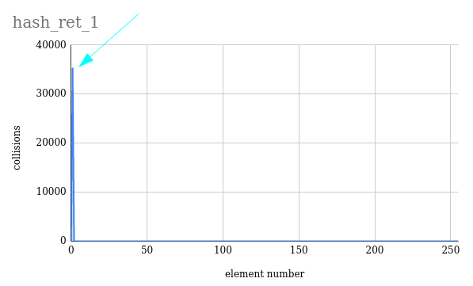
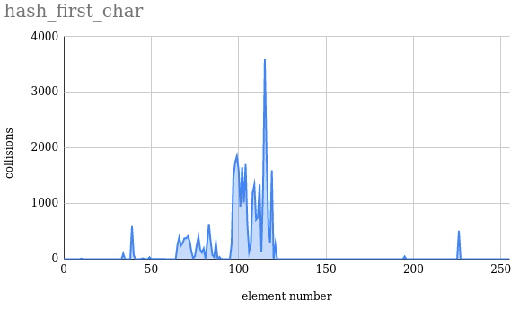
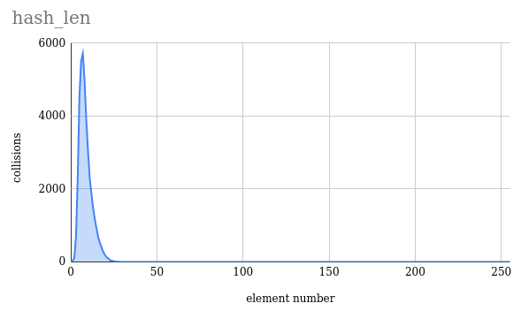
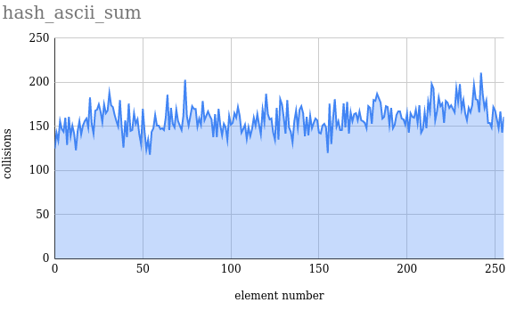
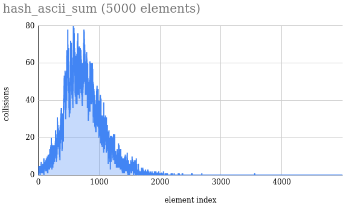
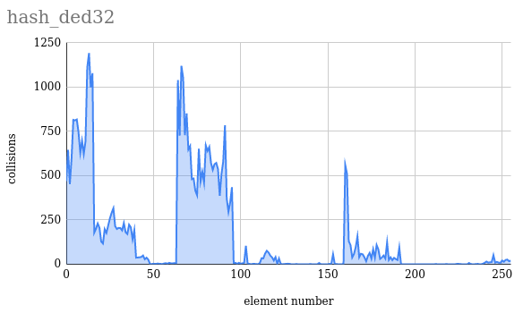
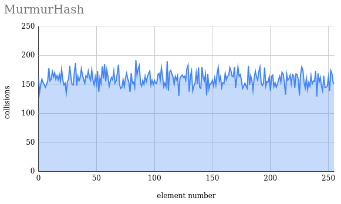
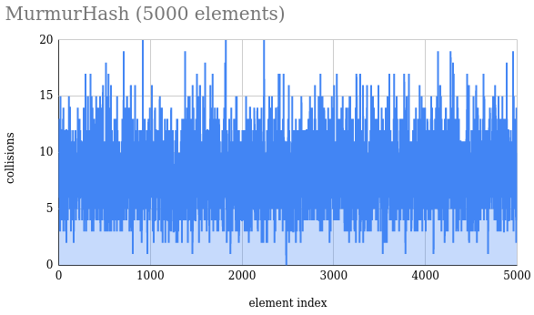
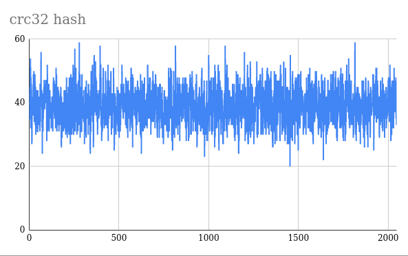

# Table of Contents
* [Introduction](#intro)
  * [What is this README about?](#about_readme)
  * [Why hash table?](#why_hash_table)
* [Build](#build)
* [Usage and documentation](#usage_n_doc)
* [Hash functions collisions test](#hash_funct)
  * [About hash functions](#about_hash_funct)
  * [Tested hash functions](#tested_funct)
  * [Results](#hash_results)
	* [Charts](#charts)
	* [Conclusion from the test](#hash_conclusion)
* [Optimizations](#opt)
  * [About testing](#about_test)
  * [Used functions for testing](#used_functions)
  * [List of optimizations](#list_of_opt)
    * [crc32 hash optimization](#crc32)
	* [AVX2 searching optimizations](#AVX2)
  * [Conclusion](#opt_results)

## Introduction 

### What is this README about? 
This README contains information about the popular data structure, the hash table.  
The hash table will be used as an example of how to optimize the code (see [List of optimizations](#list_of_opt)),  
as well as to explore some hash functions (see [Tested hash functions](#tested_funct))  

If you are only interested in **building** the project read [Build](#build).

### Why hash table? 
* Because the hash table is very fast, quite convenient and simple.  
This data structure is often used in many programs. The basic operations on that data i.e. the insertion, deletion, and searching can be (if there are no collisions) performed in O(1) time.
* Hash table is an good example of how writing optimal code can *speed up* a program.  
Because of the simplicity of the hash table, and because of the frequency of calling hash table  
functions (if you don't call hash table functions often, it's not very clear why you use a hash table  
at all), in the program appear the so-called *hotspots* - places where the program spends the most time on execution. (see [About optimizations](#about_opt))  

* Hash table can be used to check hash function collisions (See [Hash functions collision test](#hash_funct))

The biggest problem (which is solved in various fairly simple ways) hash tables in the presence of collisions. 
I used the chain method to deal with collisions. In the original, it uses a doubly linked list, however, since I
didn't start optimizing everything in a very smart way, I decided that the stack would be a faster solution. Now
I'm almost sure that this does not affect performance. In general, this does not greatly affect the hash table
itself, however, there is simply no function for deleting an element in it, just because I used a stack. Maybe
in the future I will fix it

[See the wiki for more details](https://en.wikipedia.org/wiki/Hash_table)

## Build  

~~~ 
git clone https://github.com/krisszzzz/Hash-table
~~~

After to that go to the git directory.  
Make build directory.  
~~~
mkdir build
cd build
~~~

Use cmake to build the project.  
There are 2 build options available: without optimizations and with.  
To build a project with optimizations set cmake variable HASH_TABLE_OPTIMIZED on:
~~~
cmake -DHASH_TABLE_OPTIMIZED=ON ..
~~~
To turn off optimizations:
~~~
cmake -DHASH_TABLE_OPTIMIZED=OFF ..
~~~

Cmake will create a static library *libhash_table.a*.  
Don't forget to include header, located in *include/hash_table.h* in your sources, specifying with a macro what type of library (with or without optimizations) you have built.
~~~c
#define HASH_TABLE_OPTIMIZED  
#include "/path/to/header/hash_table.h" 

/*  By default (without defining HASH_TABLE_OPTIMIZED) none 
    of optimization will be used.
    But you can manually define no optimization define
    #define HASH_TABLE_UNOPTIMIZED
*/

// your source code

~~~
After that use gcc (or any compiler) to link static library:
~~~
gcc your_source_files /path/to/lib/libhash_table.a
~~~

## Hash functions collisions test 

### About hash functions 
A hash table can be used to study hash function collisions.  
Since the indexing of a hash table is based on finding the hash of the data, we can check the uniformity of the "population" of the data.  

For an ideal hash function, the following conditions are met:
1. the hash function is deterministic, i.e. the same message results in the same hash value.
2. the hash value is quickly calculated for any message.
3. it is not possible to find a message that gives the given hash value.
4. it is impossible to find two different messages with the same hash value.
5. a small change in the message changes the hash so much that the new and old values ​​seem uncorrelated.

### About collisions test 
In simpler terms, the "population" of the data, that is, the number of elements that lie under one index in the hash table. As I said for ideal hash function it is not possible to find two different message with the smae hash value. But in real life every hash function has a so-called *collisions*.  

Collisions are different objects with the same hash. To detect them, we will take a large text and put each word into a hash table. Thus, we can check how evenly the hash function "distributes" the data in the hash table. A good hash function should do this as uniformly as possible.  

Visual illustration explaining what I was talking about:  

I used Lord of the Rings books to test collisions. These books contain 469332 words (counted with C program).  

### Tested hash functions 

I researched the following functions on collisions:  
***Click to show code.***

	
hash_ret_1()
  
	
~~~c
// A simple function for the most visual example  
inline hash_t hash_ret_1(const void* key, size_t size) { return 1; }
~~~

	
hash_first_char()
  
	
~~~c

inline hash_t hash_first_char(const void* key, size_t size)
{
        char ret = *(const char*)key;
        return (hash_t)ret;
}
~~~

	
hash_len_char()
  
	
~~~c

inline hash_t hash_len(const void *key, size_t size) { return size; }
~~~

	
hash_ascii_char()
  
	
~~~c	
inline hash_t hash_ascii_sum(const void* key, size_t size)
{
        hash_t res = 0;
        const char* char_key = (const char*)key;
        
        for (size_t iter_count = 0; iter_count < size; ++iter_count)
        {
                res += (hash_t)char_key[iter_count];
        }

        return res;
}
~~~

	
hash_ded32_char()
  

~~~c
// My sensei hash function
inline hash_t hash_ded32(const void* key, size_t size)
{
        const char* char_key = (const char*)key;
        hash_t hash = char_key[0];

        int offset = sizeof(hash_t) * 8 - 1;

        for (size_t iter_count = 1; iter_count < size; ++iter_count) {
                hash = ((hash >> 1) | (hash << offset)) ^ (hash_t)char_key[iter_count];
        }

        return hash;
}

~~~

	
MurmurHash() 
  

~~~c

inline hash_t MurmurHash(const void* key, size_t data_size)
{
        
        const hash_t          first_hash_coefficient  = 0x5bd1e993;
        const hash_t          seed                    = 0;
        const int             binary_offset           = 24;
        hash_t                hash                    = seed ^ data_size;
        const unsigned char*  data                    = (const unsigned char *)key;

        hash_t                second_hash_coefficient = 0;

        while (data_size >= 4)
        {
                second_hash_coefficient  = data[0];
                second_hash_coefficient |= data[1] << 8;
                second_hash_coefficient |= data[2] << 16;
                second_hash_coefficient |= data[3] << 24;

                second_hash_coefficient *= first_hash_coefficient;
                second_hash_coefficient ^= second_hash_coefficient >> binary_offset;
                second_hash_coefficient *= first_hash_coefficient;

                second_hash_coefficient *= first_hash_coefficient;
                hash                    ^= second_hash_coefficient;

                data      += 4;
                data_size -= 4;
        }

        switch (data_size)
        {
		case 3: {                    
			hash ^= data[2] << 16;    // We use fallthrough, to mix hash
			__attribute__((fallthrough));
		}
		case 2: {
			hash ^= data[1] << 8;
			__attribute__((fallthrough));
		}
		case 1: {
			hash ^= data[0];
			hash *= first_hash_coefficient;
			__attribute__((fallthrough));
	}    
		case 0: {
			break;
		}  
		
		default: {
			PrettyPrint("Inccorect data_size");
			return -1;
		}

        };

        hash ^= (hash >> 13);
        hash *= first_hash_coefficient;
        hash ^= (hash >> 15);

        return hash;
}

~~~

 

See the [documentation](#doc) for more info.

### Results 
#### Charts 

In most of cases I used the hash table with 256 elements. Note that I start element count from 0.  

**1. hash_ret_1**

Well, as you already understood, the result is quite obvious.  
As you can see, the peak of collisions is reached at table elements with index 1.  

**2. hash_first_char**

This result is also obvious. The peak is observed at index 115, which corresponds to the ascii character "s".  
Note that at some points the number of collisions is 0. This is explained by the fact that there are letters on which words cannot be started at all

**3. hash_len**

The peak is observed at index 7. This is due to the fact that the average length of English words is about 5.2 letters. However, in fiction, this value is usually greater.

**4. hash_ascii_sum**

Well it look pretty good, but this is because the size of the hash table is chosen correctly.  
Here is what the same function looks like, but with a 5000 element hash table:  

As you can see, the function hash behaves horribly if there are many elements in the hash table. 

**5. hash_ded32**

This hash function is bad, because its distribution already at 256 elements is extremely uneven.

**6. MurmurHash**

The collision distribution at 256 elements looks very similar to *hash_ascii_sum*, but notice how the hash function behaves if the hash table size is 5000:

As you can see this hash function is much more uniform than *hash_ascii_sum*.  

#### Сonclusion from the test 
Of all the given hash functions, only this MurmurHash can be called good. However, keep in mind that a properly sized hash table can make bad hash functions relatively good.

## Optimizations 
### About testing 
This time I still use the books "The Lord of the Rings" to see how fast and what functions work.
Everywhere I used hash table with size 2048.
Used instrument: [perf](https://perf.wiki.kernel.org/index.php/Main_Page).

Used gcc flags:
~~~shell
gcc -D NDEBUG -Ofast -mavx2 -march=native -ansi -std=gnu++2a -fcheck-new 
    -fsized-deallocation -fstack-check -fstrict-overflow
~~~

	
info about my system

~~~
# hostname : archlinux
# os release : 5.17.4-arch1-1
# perf version : 5.17.gf443e374ae13
# arch : x86_64
# nrcpus online : 8
# nrcpus avail : 8
# cpudesc : Intel(R) Core(TM) i5-9300H CPU @ 2.40GHz
# cpuid : GenuineIntel,6,158,10
# total memory : 16261960 kB
# sibling sockets : 0-7
# sibling dies    : 0-7
# sibling threads : 0,4
# sibling threads : 1,5
# sibling threads : 2,6
# sibling threads : 3,7
# CPU 0: Core ID 0, Die ID 0, Socket ID 0
# CPU 1: Core ID 1, Die ID 0, Socket ID 0
# CPU 2: Core ID 2, Die ID 0, Socket ID 0
# CPU 3: Core ID 3, Die ID 0, Socket ID 0
# CPU 4: Core ID 0, Die ID 0, Socket ID 0
# CPU 5: Core ID 1, Die ID 0, Socket ID 0
# CPU 6: Core ID 2, Die ID 0, Socket ID 0
# CPU 7: Core ID 3, Die ID 0, Socket ID 0
# node0 meminfo  : total = 16261960 kB, free = 9847212 kB
# node0 cpu list : 0-7
# CPU cache info:
#  L1 Data                 32K [0,4]
#  L1 Instruction          32K [0,4]
#  L1 Data                 32K [1,5]
#  L1 Instruction          32K [1,5]
#  L1 Data                 32K [2,6]
#  L1 Instruction          32K [2,6]
#  L1 Data                 32K [3,7]
#  L1 Instruction          32K [3,7]
#  L2 Unified             256K [0,4]
#  L2 Unified             256K [1,5]
#  L2 Unified             256K [2,6]
#  L2 Unified             256K [3,7]
#  L3 Unified            8192K [0-7]
~~~

	

### Used functions for testing 
List of functions that will be used to test the hash table.  
Not all functions are collected here, but I will talk about all of them in the appropriate section.  

*Functions to test hash functions*

	
test_hash_function()

	
~~~c
inline int test_hash_function(const char* const buffer,
                              const int         size,
                              const int         iter_count)
{
        
        int offset      = 0;
        hash_t hash_res = iter_count;

                        
        while(offset < size) {
                hash_res += MurmurHash(&buffer[offset], MAX_WORD_SIZE);  
				// Used to store hash result, adding to turn off
                // unwanted optimization from compiler
				
				// Note that for fast_hash function code will look like this:
				// hash_res += fast_hash(&buffer[offset], MAX_WORD_SIZE);
				
                offset += MAX_WORD_SIZE;
        }

        return hash_res; // return temp just because it can be optimized and hash don't will be calculated 

}

~~~
	

	
unit_test_hash_function()

	
~~~c

inline void unit_test_hash_function(const char* const file_name,
                                    const int         max_iter_count)
{

        hash_t result = 0;
        int size = 0;
        char* buffer = load_file("Example.txt", &size);

        if (buffer == nullptr) {
                PrettyPrint("File loading error\n");
                return; 
        }

        for (int iter_count = 0; iter_count < max_iter_count; ++iter_count) {
                result = test_hash_function(buffer, size, iter_count);
        }
 

        printf("%d\n", result);
        // Used to avoiding unwanted compiler optimizations
        // (since the Ofast flag is set, it may well not consider the value of the result variable at all)

}
~~~
		

 

This is functions used to fill hash table with words.

	
is_sign()

	
~~~c
int is_sign(const char character)
{
        switch(character) {
        case ' ':
        case '\n':
        case '.':
        case '!':
        case ',':
        case '?':
        case '\'':
        case '\"':
                return 1;
        default:
                return 0; 
        };
}

~~~

	
word_length()

~~~c
// Function to count word length. Needed to populate a hash table with words
int word_length(const char* const string)
{
        if (string == nullptr) {
                PrettyPrint("Unexpected nullptr string\n"); // See documentain for log.h and log.cpp files
                // Used to more beautiful output the errors
                return -1;
        }

        int iter_count = 0;
		
        for (; string[iter_count] != '\0' && !is_sign(string[iter_count]); ++iter_count) ;

         return iter_count;
}

~~~

	
skip_spaces_n_marks()

	
~~~c
// Skip spaces between words 
void skip_spaces_n_marks(char** string)
{
        if (string == nullptr) {
                PrettyPrint("Unexpected nullptr string (const char** string)\n");
                // Used to more beautiful output the errors
                // You can find description of PrettyPrint() in log.h and log.cpp documentations
                return;
        }

        if (*string == nullptr) {
                PrettyPrint("Unexpected nullptr *string (const char* string)\n");
                return;
        }
        
        while (is_sign(**string)) {
                (*string) += 1;
        }

}

~~~

 

Simple unit test for hash table searching speed

	
unit_test_search()

	
~~~c

// Test hash table by opening file and populating a hash table with words
// Used in unoptimized version

int unit_test_search(hash_table* const table, const char* const file_name, const int max_iter_count)
{
        if (file_name == nullptr) {
                PrettyPrint("Unexpected nullptr file_name\n");
                // Used to more beautiful output the errors
                // You can find description of PrettyPrint() in log.h and log.cpp documentations
                return -1;
        }

        if (table == nullptr) {
                PrettyPrint("Unexpected nullptr table (hash_table* const)\n");
                return -1;
        }

        char* buffer = load_file(file_name);
        // Open file and load data to buffer
        // You can find description of load_file() in file_read.h documentation

        char* to_free = buffer;

        if (buffer == nullptr) {
                PrettyPrint("File loading error\n");
                return -1; 
        }

        skip_spaces_n_marks(&buffer);
        
        while (*buffer != '\0') {
                int word_len = word_length(buffer);
                add_element(table, buffer, word_len);
                // add word to hash table
                // You can see description of add_element() in hash_table_no_opt.h and in hash_table_opt.h
				
                buffer += word_len;
                skip_spaces_n_marks(&buffer);
        }

        free(to_free);
		
        const char* test_word = "this_word_not_in_hash_table";

        for (int iter_count = 0; iter_count < max_iter_count; ++iter_count) {
                hash_table_search(table, test_word, strlen(test_word), nullptr, nullptr);
        }

        return 0;
}

~~~

	

 

Sometimes I will specify how many iterations will be carried out in a loop.
Also the executable name is *stat*.

### List of optimizations 
#### Crc32 hash optimization 
Let's start. The first thing I did was rewrite my hash function. Together with *MurmurHash()* I use a function from intel for 
faster hashing. Here is the code for the hash function. It uses *\_mm\_crc32\_u64* intel function. You can see comparison between *MurmurHash()* and *fast\_hash()*. *Note*: MurmurHash and fast\_hash has 
following gcc *\_\_attributes\_\_*: *hot*, *pure*, *always\_inline*.  
See *Murmurhash()* code [here](#Murmur).  
See *fast_hash()* below:

	
fast_hash()

	
~~~c
	inline hash_t fast_hash(const void* data, const size_t size)
{
        u_int64_t crc     = 0xDED; // Random value
        u_int64_t* i_data = (u_int64_t*)data;
        
        return  _mm_crc32_u64(crc, i_data[0]) |  (_mm_crc32_u64(crc, i_data[1]) ^
                                                  _mm_crc32_u64(crc, i_data[2]))
                && _mm_crc32_u64(crc, i_data[3]);

}
~~~
	

 	
	

*MurmurHash with 1000000 iterations count in unit_test_hash_function. Used text The Lord of the Rings*

*fast_hash with 1000000 iterations count in unit_test_hash_function. Used text The Lord of the Rings*

As you can see, the hash function has become about 10.5 times faster. Pretty good.
You can also take a look at the word distribution graphs for crc32. It is also look pretty good.

#### AVX2 searching optimizations 

It makes sense to change the comparison and search for elements. For this we will use AVX2 instructions. Also I used some gcc attributes (*\_\_attribute__()* like *hot*, *nonull*, see [gcc functions attributes](https://gcc.gnu.org/onlinedocs/gcc/Function-Attributes.html)).

So I have optimized the searching function. This is how unoptimized version look:

	
hash_table_search()

~~~c
int hash_table_search(hash_table* const self,        const char* const element,
                      const size_t      elem_size,   int*              in_table_pos,
                      int*              in_stack_pos)
{
        if (self == nullptr) {
                PrettyPrint("Unexpected nullptr self (hash_table* const)\n");
                return NULLPTR_ERROR;
        }

        if (element == nullptr) {
                PrettyPrint("Unexpected nullptr element (const char* const)\n");
                return NULLPTR_ERROR;
        }

        hash_t elem_index                 = self->hash_function(element, elem_size) % self->size;
        stack_node* current_stack_elem = self->data[elem_index].elements;
        
        for (int iter_count = 0; iter_count < self->data[elem_index].size; ++iter_count) {
                if (strncmp(current_stack_elem[iter_count].data, element, elem_size) == 0 && !current_stack_elem[iter_count].data[elem_size]) {
                        if (in_table_pos && in_stack_pos) {
                                *in_table_pos = elem_index;
                                *in_stack_pos = iter_count;
                        }
                        
                        return 1;
                } 
        }
              
        return 0; 
}

~~~

 

This is AVX2 version of searching:

	
hash_table_search()

	
~~~c
	int hash_table_search(hash_table *const __restrict self,
                      const char *const __restrict element,
                      const size_t                 elem_size,
                      int *const __restrict        in_table_pos,
                      int *const __restrict        in_stack_pos)
{
        alignas(32) char temp[MAX_WORD_SIZE] = {};

        hash_t elem_index              = MurmurHash(element, elem_size) % SIZE;
        stack_node* current_stack_elem = DATA(elem_index).elements;
        
        int size = DATA(elem_index).size;
        strncpy(temp, element, elem_size);

        __m256i to_cmp = _mm256_load_si256((__m256i*)temp);
        
        for (int iter_count = 0; iter_count < size; ++iter_count) {
                
                __m256i mask        = _mm256_cmpeq_epi8(to_cmp, STACK_DATA(iter_count));
                unsigned int i_mask = (unsigned int)_mm256_movemask_epi8(mask);
                if (i_mask == 0xFFFFFFFF) {
                        if (in_table_pos && in_stack_pos) {
                                *in_table_pos = elem_index;
                                *in_stack_pos = iter_count;
                        }

                        return 1;
                }

        }
        

        return 0;
}

~~~

 

The testing function is *unit_test_search()*. (See [About testing](#about_test))

*No optimizitions, MurmurHash(), 10000000 iterations:*
	

*Optimized, MurmurHash(), 10000000 iterations:*
	

So the searching became 2 times faster. It also good result.

### Conclusion 
Thanks to optimization, it is possible to achieve acceleration, usually somewhere in 2-3 times, however, in some cases, the increase is absolutely not significant.
