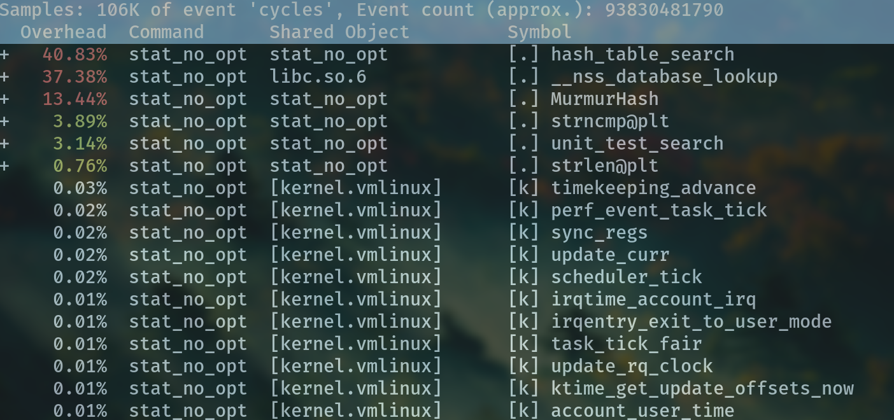
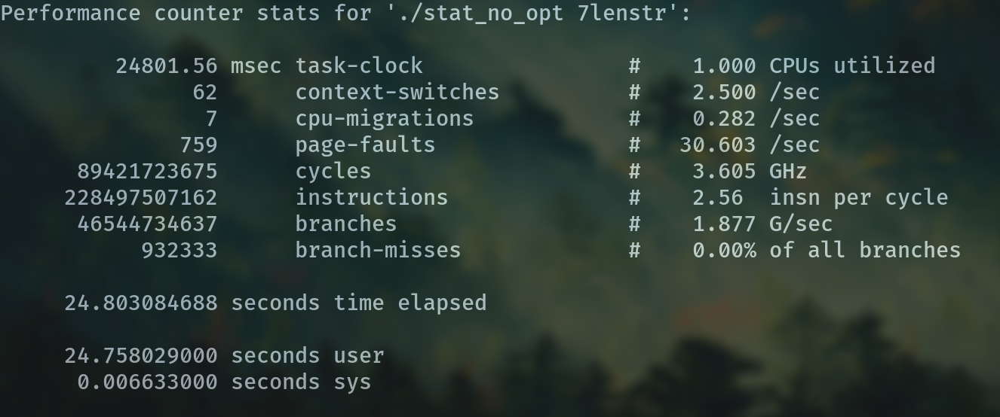
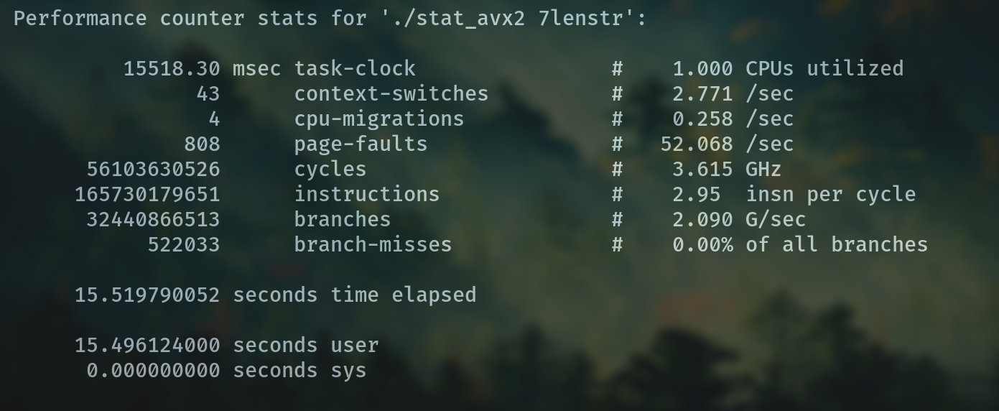
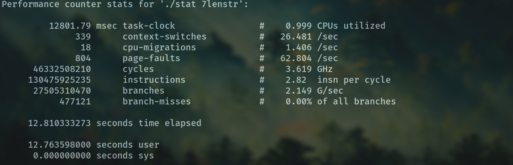
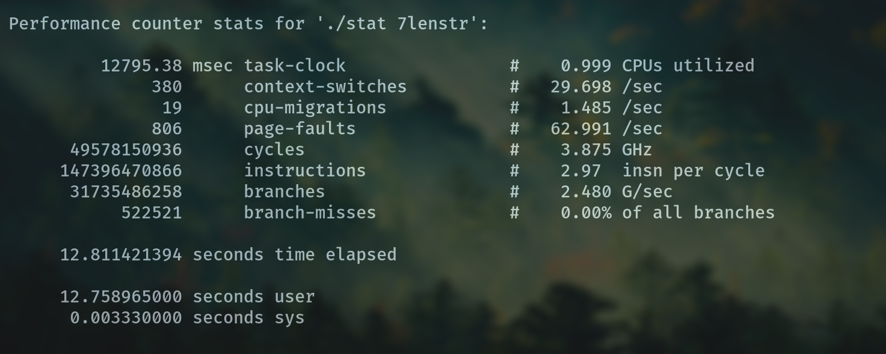

# Оглавление
* [Введение](#intro)
  * [О чем это README?](#about_readme)
  * [Почему хеш-таблица?](#why_hash_table)
* [Сборка](#build)
* [Использование](#usage_n_doc)
* [Проверка хеш-функции на коллизии](#hash_funct)
  * [О хеш-функциях](#about_hash_funct)
  * [Используемые хеш-функции](#tested_funct)
  * [Результаты](#hash_results)
	* [Графики](#charts)
	* [Вывод](#hash_conclusion)
* [Оптимизации](#opt)
  * [О тестировании](#about_test)
  * [Функции, используемые для тестов](#used_functions)
  * [Список Оптимизаций](#list_of_opt)    
    * [Оптимизация с помощью AVX2](#AVX2)
  * [Вывод](#opt_results)

## Введение 

### О чем это README? 
Это README содержит информации о популярной структуре данных, хеш-таблице.  
Хеш-таблица будет использована как хороший пример, как можно оптимизировать программую (см. [Список оптимизаций](#list_of_opt)),  
а также для исследования хеш-функции (см. [Тестируемые хеш-функции](#tested_funct))  

Если вас интересует только сборка см. [Сборка](#build).

### Почему хеш-таблица? 
* Потому что это быстро, эффективно и просто.  
Эта структура очень часто используется в разных программах. Основная причина, в том что вставка, добавление и удаление может быть воспроизвено за время О(1).
* Хеш-таблица это хороший пример для оптимизации программы.  

* Хеш-таблица может быть использована для исследования хеш-функции (см [Проверка хеш-функции на коллизии](#hash_funct))

## Сборка  

~~~ 
git clone https://github.com/krisszzzz/Hash-table
~~~

Зайдите в склонированный репозиторий.    
~~~
mkdir build
cd build
~~~

Соберите проект с помощью cmake.  
Доступны 2 типа сборок: с оптимизациями или без.  
Чтобы собрать с оптизациями:
~~~
cmake -DHASH_TABLE_OPTIMIZED=ON ..
~~~
Выключить оптимизации:
~~~
cmake -DHASH_TABLE_OPTIMIZED=OFF ..
~~~

cmake создаст статическую библиотеку *libhash_table.a*.  
Не забудьте включить хедер, находящийся в *include/hash_table.h* в склонированном репизотории. Укажите макрос HASH_TABLE_OPTIMIZED, если вы собирали сборку с оптизациями.
~~~c
#define HASH_TABLE_OPTIMIZED  
#include "/path/to/header/hash_table.h" 

/*  By default (without defining HASH_TABLE_OPTIMIZED) none 
    of optimization will be used.
    But you can manually define no optimization define
    #define HASH_TABLE_UNOPTIMIZED
*/

// Ваш исходник

~~~
После это слинкуйте все вместе с помощью gcc:
~~~
gcc your_source_files /path/to/lib/libhash_table.a
~~~

## Тест хеш-функции на коллизии 

### О хеш-функциях 
Хеш-таблицу можно использовать для исследования хеш-функций. Проверяя "заселенность" хеш-таблицы можно определить качество хеш-функции  

### О тесте на коллизии 
Коллизии - это совпадение хешей двух разных объектов.    

Наглядная визуальная иллюстрация:  

Я использовать текст Толкиена "Властелении колец", содержащей примерно 462000 слов.  

### Тестируемые хеш-функции 

Я ииследовал следущие хеш-функции:  

	
hash_ret_1()
  
	
~~~c
// A simple function for the most visual example  
inline hash_t hash_ret_1(const void* key, size_t size) { return 1; }
~~~

	
hash_first_char()
  
	
~~~c

inline hash_t hash_first_char(const void* key, size_t size)
{
        char ret = *(const char*)key;
        return (hash_t)ret;
}
~~~

	
hash_len_char()
  
	
~~~c

inline hash_t hash_len(const void *key, size_t size) { return size; }
~~~

	
hash_ascii_char()
  
	
~~~c	
inline hash_t hash_ascii_sum(const void* key, size_t size)
{
        hash_t res = 0;
        const char* char_key = (const char*)key;
        
        for (size_t iter_count = 0; iter_count < size; ++iter_count)
        {
                res += (hash_t)char_key[iter_count];
        }

        return res;
}
~~~

	
hash_ded32_char()
  

~~~c
// My sensei hash function
inline hash_t hash_ded32(const void* key, size_t size)
{
        const char* char_key = (const char*)key;
        hash_t hash = char_key[0];

        int offset = sizeof(hash_t) * 8 - 1;

        for (size_t iter_count = 1; iter_count < size; ++iter_count) {
                hash = ((hash >> 1) | (hash << offset)) ^ (hash_t)char_key[iter_count];
        }

        return hash;
}

~~~

	
MurmurHash() 
  

~~~c

inline hash_t MurmurHash(const void* key, size_t data_size)
{
        
        const hash_t          first_hash_coefficient  = 0x5bd1e993;
        const hash_t          seed                    = 0;
        const int             binary_offset           = 24;
        hash_t                hash                    = seed ^ data_size;
        const unsigned char*  data                    = (const unsigned char *)key;

        hash_t                second_hash_coefficient = 0;

        while (data_size >= 4)
        {
                second_hash_coefficient  = data[0];
                second_hash_coefficient |= data[1] << 8;
                second_hash_coefficient |= data[2] << 16;
                second_hash_coefficient |= data[3] << 24;

                second_hash_coefficient *= first_hash_coefficient;
                second_hash_coefficient ^= second_hash_coefficient >> binary_offset;
                second_hash_coefficient *= first_hash_coefficient;

                second_hash_coefficient *= first_hash_coefficient;
                hash                    ^= second_hash_coefficient;

                data      += 4;
                data_size -= 4;
        }

        switch (data_size)
        {
		case 3: {                    
			hash ^= data[2] << 16;    // We use fallthrough, to mix hash
			__attribute__((fallthrough));
		}
		case 2: {
			hash ^= data[1] << 8;
			__attribute__((fallthrough));
		}
		case 1: {
			hash ^= data[0];
			hash *= first_hash_coefficient;
			__attribute__((fallthrough));
	}    
		case 0: {
			break;
		}  
		
		default: {
			PrettyPrint("Inccorect data_size");
			return -1;
		}

        };

        hash ^= (hash >> 13);
        hash *= first_hash_coefficient;
        hash ^= (hash >> 15);

        return hash;
}

~~~

 

### Результаты 
#### Графики 

В большинстве случаев я использал 256 элементов для хеш-таблицы.  

**1. hash_ret_1**  

Очевидный пример для демонстрации.  
Пик коллизии находится в 1.  

**2. hash_first_char**  
Также довольно очевидный пример плохой хеш-функции.  

  

**3. hash_len**  
Заметим, что пик достигается в точке 7 (горизонтальная ось). Эта свазяна с тем, что средняя длина строк в английском языке составляет где-то 6-7 символов. 

	
**4. hash_ascii_sum**  
Хорошо выглядящая хеш-функции, однако тут не правильно подобран размер хеш-таблицы. Заметим, что данная хеш-функции ограниченна суммой ASCII-кодов символов.  
	
Размер хеш-таблицы 256:  

Рамер хеш-таблицы 5000:  

Как вы видите здесь возникает значительные проблемы с хеш-функцией и коллизиями.  
	
**5. hash_ded32**  
	
Функция, предложенное моим учителем по информатике.  

**6. MurmurHash**  
	
Функция, которая в дальнейшем будет использоваться в хеш-таблице по умолчанию.  
	
При размере 256:  

При размере 5000:  

#### Вывод 
Из всех использованных хеш-функции нормальной можно считать MurmurHash().

## Оптимизации 
Взглянем на время выполнения без оптимизаций. Я предполагаю, что хеш-таблица будет использована для поиска элемента в хеш-таблице, поэтому и оптимизировать я буду функцию поиска. Про тестирующие функции вы можете прочитать ниже. Везде использалась хеш-таблица размером 2048 элементов.  

*unit_test_search()* - функция для тестирования поиска. (см [О тестировании](#about_test))  

**Не оптимизораванной поиск в хеш-таблице, число поисков (итераций) 500000000**  

Начнем оптимизировать функцию *hash_table_search()* - функция поиска в хеш-таблице, а затем *MurmurHash()* - функцию хеширования.  

### О тестировании 
Используемые инструменты: [perf](https://perf.wiki.kernel.org/index.php/Main_Page).

Использованные флаги gcc:
~~~shell
gcc -D NDEBUG -Ofast -mavx2 -march=native -ansi -std=gnu++2a -fcheck-new 
    -fsized-deallocation -fstack-check -fstrict-overflow
~~~

	
Информация о системе

~~~
# hostname : archlinux
# os release : 5.17.4-arch1-1
# perf version : 5.17.gf443e374ae13
# arch : x86_64
# nrcpus online : 8
# nrcpus avail : 8
# cpudesc : Intel(R) Core(TM) i5-9300H CPU @ 2.40GHz
# cpuid : GenuineIntel,6,158,10
# total memory : 16261960 kB
# sibling sockets : 0-7
# sibling dies    : 0-7
# sibling threads : 0,4
# sibling threads : 1,5
# sibling threads : 2,6
# sibling threads : 3,7
# CPU 0: Core ID 0, Die ID 0, Socket ID 0
# CPU 1: Core ID 1, Die ID 0, Socket ID 0
# CPU 2: Core ID 2, Die ID 0, Socket ID 0
# CPU 3: Core ID 3, Die ID 0, Socket ID 0
# CPU 4: Core ID 0, Die ID 0, Socket ID 0
# CPU 5: Core ID 1, Die ID 0, Socket ID 0
# CPU 6: Core ID 2, Die ID 0, Socket ID 0
# CPU 7: Core ID 3, Die ID 0, Socket ID 0
# node0 meminfo  : total = 16261960 kB, free = 9847212 kB
# node0 cpu list : 0-7
# CPU cache info:
#  L1 Data                 32K [0,4]
#  L1 Instruction          32K [0,4]
#  L1 Data                 32K [1,5]
#  L1 Instruction          32K [1,5]
#  L1 Data                 32K [2,6]
#  L1 Instruction          32K [2,6]
#  L1 Data                 32K [3,7]
#  L1 Instruction          32K [3,7]
#  L2 Unified             256K [0,4]
#  L2 Unified             256K [1,5]
#  L2 Unified             256K [2,6]
#  L2 Unified             256K [3,7]
#  L3 Unified            8192K [0-7]
~~~

	

### Тестирующие функции 
Все функции, использованные для тестирования функции поиска.    

Функции для заполнения хеш-таблицы.

	
is_sign()

	
~~~c
int is_sign(const char character)
{
        switch(character) {
        case ' ':
        case '\n':
        case '.':
        case '!':
        case ',':
        case '?':
        case '\'':
        case '\"':
                return 1;
        default:
                return 0; 
        };
}

~~~

	
word_length()

~~~c
// Function to count word length. Needed to populate a hash table with words
int word_length(const char* const string)
{
        if (string == nullptr) {
                PrettyPrint("Unexpected nullptr string\n"); // See documentain for log.h and log.cpp files
                // Used to more beautiful output the errors
                return -1;
        }

        int iter_count = 0;
		
        for (; string[iter_count] != '\0' && !is_sign(string[iter_count]); ++iter_count) ;

         return iter_count;
}

~~~

	
skip_spaces_n_marks()

	
~~~c
// Skip spaces between words 
void skip_spaces_n_marks(char** string)
{
        if (string == nullptr) {
                PrettyPrint("Unexpected nullptr string (const char** string)\n");
                // Used to more beautiful output the errors
                // You can find description of PrettyPrint() in log.h and log.cpp documentations
                return;
        }

        if (*string == nullptr) {
                PrettyPrint("Unexpected nullptr *string (const char* string)\n");
                return;
        }
        
        while (is_sign(**string)) {
                (*string) += 1;
        }

}

~~~

 

Юнит-тест для функции поиска  

	
unit_test_search()

	
~~~c

// Test hash table by opening file and populating a hash table with words
// Used in unoptimized version

int unit_test_search(hash_table* const table, const char* const file_name, const int max_iter_count)
{
        if (file_name == nullptr) {
                PrettyPrint("Unexpected nullptr file_name\n");
                // Used to more beautiful output the errors
                // You can find description of PrettyPrint() in log.h and log.cpp documentations
                return -1;
        }

        if (table == nullptr) {
                PrettyPrint("Unexpected nullptr table (hash_table* const)\n");
                return -1;
        }

        char* buffer = load_file(file_name);
        // Open file and load data to buffer
        // You can find description of load_file() in file_read.h documentation

        char* to_free = buffer;

        if (buffer == nullptr) {
                PrettyPrint("File loading error\n");
                return -1; 
        }

        skip_spaces_n_marks(&buffer);
        
        while (*buffer != '\0') {
                int word_len = word_length(buffer);
                add_element(table, buffer, word_len);
                // add word to hash table
                // You can see description of add_element() in hash_table_no_opt.h and in hash_table_opt.h
				
                buffer += word_len;
                skip_spaces_n_marks(&buffer);
        }

        free(to_free);
		
        const char* test_word = "this_word_not_in_hash_table";

        for (int iter_count = 0; iter_count < max_iter_count; ++iter_count) {
                hash_table_search(table, test_word, strlen(test_word), nullptr, nullptr);
        }

        return 0;
}

~~~

	

 

### Список оптимизаций 

#### Оптимизация с помощью AVX2 инструкций 

Для ускорения функции поиска можно использовать AVX2-инструкции и intrinsic-функций, подключаемых из хедера "<immitrin.h>".

Неоптимизированная версия функции поиска:

	
hash_table_search()

~~~c
int hash_table_search(hash_table* const self,        const char* const element,
                      const size_t      elem_size,   int*              in_table_pos,
                      int*              in_stack_pos)
{
        if (self == nullptr) {
                PrettyPrint("Unexpected nullptr self (hash_table* const)\n");
                return NULLPTR_ERROR;
        }

        if (element == nullptr) {
                PrettyPrint("Unexpected nullptr element (const char* const)\n");
                return NULLPTR_ERROR;
        }

        hash_t elem_index                 = self->hash_function(element, elem_size) % self->size;
        stack_node* current_stack_elem = self->data[elem_index].elements;
        
        for (int iter_count = 0; iter_count < self->data[elem_index].size; ++iter_count) {
                if (strncmp(current_stack_elem[iter_count].data, element, elem_size) == 0 && !current_stack_elem[iter_count].data[elem_size]) {
                        if (in_table_pos && in_stack_pos) {
                                *in_table_pos = elem_index;
                                *in_stack_pos = iter_count;
                        }
                        
                        return 1;
                } 
        }
              
        return 0; 
}

~~~

 

Функции поиска с использованием AVX2-инструкций:

	
hash_table_search()

	
~~~c
	int hash_table_search(hash_table *const __restrict self,
                      const char *const __restrict element,
                      const size_t                 elem_size,
                      int *const __restrict        in_table_pos,
                      int *const __restrict        in_stack_pos)
{
        alignas(32) char temp[MAX_WORD_SIZE] = {};

        hash_t elem_index              = MurmurHash(element, elem_size) % SIZE;
        stack_node* current_stack_elem = DATA(elem_index).elements;
        
        int size = DATA(elem_index).size;
        strncpy(temp, element, elem_size);

        __m256i to_cmp = _mm256_load_si256((__m256i*)temp);
        
        for (int iter_count = 0; iter_count < size; ++iter_count) {
                
                __m256i mask        = _mm256_cmpeq_epi8(to_cmp, STACK_DATA(iter_count));
                unsigned int i_mask = (unsigned int)_mm256_movemask_epi8(mask);
                if (i_mask == 0xFFFFFFFF) {
                        if (in_table_pos && in_stack_pos) {
                                *in_table_pos = elem_index;
                                *in_stack_pos = iter_count;
                        }

                        return 1;
                }

        }
        

        return 0;
}

~~~

 

Результаты:  
**Не оптимизированный поиска, число поисков (итераций) 500000000**  

**Оптимизированная с использованием AVX2-инструкций, число поисков (итераций) 500000000**  

Функция стала работать на 60% быстрее.

### Вставка ассемблерного кода (inline assembler)
Я переписал хеш-функции с помощью ассемблерной вставки. Я построил таблицу переход для ускорения хеширования.   
Для создания такой таблицы я объявил эти метки в С коде, а затем поместил в статическую переменную. Это решение связано с тем, что в ассемблерной вставке нельзя объявлять данные так, чтобы код оставался position-independent (pie). Чтобы объявить метку в С нужно объявить функции, но использованием ключевого слова asm("название метки") (см [gcc inline asssembler](https://gcc.gnu.org/onlinedocs/gcc/Extended-Asm.html)).  
Код функции:  

	
fast_hash_function()

	
~~~c

#define LABEL(label_name)                              \
        extern void label_name() asm(#label_name);
// Find the used in inline assembler code labels
LABEL(equal_1);
LABEL(equal_2);
LABEL(equal_3);
LABEL(equal_4);
LABEL(equal_5);
LABEL(equal_6);
LABEL(equal_7);
LABEL(equal_8);
LABEL(more_8);

hash_t fast_hash_function(const char* const __restrict data, const int size)
{
                // Jmp table depend on size ==
        static u_int64_t jmp_table[32] = {       
                (u_int64_t)equal_1, // == 1
                (u_int64_t)equal_2, // == 2
                (u_int64_t)equal_3, // == 3
                (u_int64_t)equal_3, // == 4
                (u_int64_t)equal_4, // == 5
                (u_int64_t)equal_5, // == 6 
                (u_int64_t)equal_6, // == 7
                (u_int64_t)equal_7, // == 8
                (u_int64_t)equal_8, // == 9
                (u_int64_t)more_8,  // == 10
                (u_int64_t)more_8,  // == 11
                (u_int64_t)more_8,  // == 12
                (u_int64_t)more_8,  // == 13
                (u_int64_t)more_8,  // == 14
                (u_int64_t)more_8,  // == 15
                (u_int64_t)more_8,  // == 16
                (u_int64_t)more_8,  // == 17
                (u_int64_t)more_8,  // == 18
                (u_int64_t)more_8,  // == 19
                (u_int64_t)more_8,  // == 20
                (u_int64_t)more_8,  // == 21
                (u_int64_t)more_8,  // == 22
                (u_int64_t)more_8,  // == 23
                (u_int64_t)more_8,  // == 24
                (u_int64_t)more_8,  // == 25
                (u_int64_t)more_8,  // == 26
                (u_int64_t)more_8,  // == 27
                (u_int64_t)more_8,  // == 28
                (u_int64_t)more_8,  // == 29
                (u_int64_t)more_8,  // == 30
                (u_int64_t)more_8,  // == 31
                (u_int64_t)more_8,  // == 32
       };
        
        u_int64_t hash = 0;
        
        asm (
            "push %%r9\n\t"
            "push %%r10\n\t"
            "push %%r11\n\t"
            "push %%rsi\n\t"
            "push %%rdi\n\t"
            "xor %%r11, %%r11\n\t"
            "xor %%r10, %%r10\n\t"
            "lea %0, %%rax\n\t"
            "jmp *(%%rax, %%rsi, 8)\n\t"
            "more_8:\n\t"
            "mov (%%rdi), %%r9d\n\t"
            "crc32 %%r9d, %%r10d\n\t"
            "add %%r10, %%r11\n\t"
            "sub $0x8, %%rdi\n\t"
            "sub $0x8, %%rsi\n\t"
            "jmp *(%%rax,%%rsi, 8)\n\t"
            
            "equal_8:\n\t"
            "mov (%%rdi), %%r9d\n\t"
            "crc32 %%r9d, %%r10d\n\t"
            "jmp adding\n\t"
            "equal_7:\n\t"
            "mov (%%rdi), %%r9d\n\t"
            "mov 0x4(%%rdi), %%ax\n\t"
            "xor %%r9d, %%eax\n\t"
            "mov 0x6(%%rdi), %%r9b\n\t"
			"xor %%r9b, %%al\n\t"
            "crc32 %%eax, %%r10d\n\t"
            "jmp adding\n\t"
            "equal_6:\n\t"
            "mov (%%rdi), %%r9d\n\t"
            "mov 0x4(%%rdi), %%r10d\n\t"
            "crc32 %%r9d, %%r10w\n\t"
            "jmp adding\n\t"
            "equal_5:\n\t"
            "mov (%%rdi), %%r9d\n\t"
            "mov 0x4(%%rdi), %%al\n\t"
            "xor %%r9d, %%eax\n\t"
            "crc32 %%eax, %%r10d\n\t"
            "jmp adding\n\t"
            "equal_4:\n\t"
            "mov (%%rdi), %%r9d\n\t"
            "crc32 %%r9d, %%r10d\n\t"
            "jmp adding\n\t"
            "equal_3:\n\t"
            "mov (%%rdi), %%r9w\n\t"
            "mov 0x2(%%rdi), %%r10b\n\t"
            "xor %%r10d, %%r9d\n\t"
            "crc32 %%r9w, %%r10d\n\t"
            "jmp adding\n\t"
            "equal_2:\n\t"
            "mov (%%rdi), %%r9w\n\t"
            "crc32 %%r9w, %%r10d\n\t"
            "jmp adding\n\t"
            "equal_1:\n\t"
            "mov (%%rdi), %%r9b\n\t"
            "crc32 %%r9b, %%r10d\n\t"
            
            "adding:\n\t"
            "add %%r10, %%r11\n\t"
            "and $0x7ff, %%r11\n\t"
            "mov %%r11, %1\n\t"
            "pop %%rdi\n\t"
            "pop %%rsi\n\t"
            "pop %%r11\n\t"
            "pop %%r10\n\t"
            "pop %%r9\n\t"
            :"=m"(jmp_table)
            :"r"(hash),
             "r"(data),
             "r"(size)
             );

        return hash;
 
}

~~~

 

Код ассемблера на Intel синтаксисе:  

Intel syntax assembler

~~~assembler

push rdx
push r9
push r10
push r11
push rsi
push rdi
xor r11, r11
xor r10, r10
mov rax jmp_table
jmp [rax + rsi*8]
more_8:
mov r9d, [rdi]
crc32 r10d, r9d
add r11, r10
sub rdi, 8
sub rsi, 8
jmp [rax + rsi*8]

equal_8:
mov r9d, [rdi]
crc32 r10d, r9d
jmp adding

equal_7:
mov r9, [rdi]
mov ax, [rdi + 4]
xor eax, r9d
mov r9b, [rdi + 6]
xor r9b, al
crc32 r10d, eax
jmp adding

equal_6:
mov r9d, [rdi]
mov r10w, [rdi+4]
crc32 r10d, r9d
jmp adding

equal_5:
mov r9d, [rdi]
mov r10b, [rdi+4]
crc32 r10d, r9d
jmp adding

equal_4:
mov r9d, [rdi]
crc32 r10d, r9d
jmp adding

equal_3:
mov r9w, [rdi]
mov r10b, [rdi+2]
xor r9d, r10d
crc32 r10d, r9w
jmp adding

equal_2:
mov r9w, [rdi]
crc32 r10d, r9w
jmp adding

equal_1:
mov r9b, [rdi]
crc32 r10d, r9b

adding:
add r11, r10
and r11, 0x7ff ; Division to 2048
mov [hash], r11
pop rdi
pop rsi
pop r11
pop r10
pop r9

~~~

 

**Функция поиска с AVX2-инструкциями, число поисков (итераций) 500000000**  

**Функция поиска с AVX2-инструкциями + ассемблерная вставка, число поисков (итераций) 500000000**  

Ускорение составляет где-то 25%. Это связано с тем, что новая функция не содержат ни одного цикла. Интересным побочным эффектом является, то что хеширование данной хеш-функции не зависит от длины слова (так как циклов нет). Это может дать ускорение большее на длинных словах.

### Переписывание функции на ассемблере
В последней оптимизации я полностью переписал функцию поиска на ассемблера и статически слинковал объектный файл с моим проектом.  

	
Ассемблерный код на Intel синтаксисе

	
~~~
hash_table_search_asm	
push   rbp
mov    rbp,rsp
push   r15
push   r14
push   r13
push   r12
push   rbx
and    rsp,0xffffffffffffffe0
sub    rsp,0x1000
or     QWORD PTR [rsp],0x0
sub    rsp,0x60
or     QWORD PTR [rsp],0x0
add    rsp,0x1020
vpxor  xmm0,xmm0,xmm0
mov    r9,rdi
mov    rdi,rsi
mov    esi,edx
mov    QWORD PTR [rsp+0x38],rax
xor    eax,eax
vmovdqa XMMWORD PTR [rsp],xmm0
vmovdqa XMMWORD PTR [rsp+0x10],xmm0
call   fast_hash_function 
mov    r12,rax
shl    rax,0x5
add    rax,QWORD PTR [r9+0x8]
mov    rbx,QWORD PTR [rax]
mov    r15d,DWORD PTR [rax+0xc]
mov    rax,rsp
mov    rsi,rdi
movsxd rdx,edx
mov    rdi,rax
mov    r13,rcx
mov    r14,r8
call   strncpy 
vmovdqa ymm1,YMMWORD PTR [rsp]
test   r15d,r15d
jle    Exit  
mov    rax,rbx
xor    edx,edx
jmp   .start_cmp 
nop    DWORD PTR [rax+rax*1+0x0]
.cycle:	
inc    edx
add    rax,0x20
cmp    r15d,edx
je     Exit
.start_cmp:
vpcmpeqb ymm0,ymm1,YMMWORD PTR [rax]
vpmovmskb ecx,ymm0
cmp    ecx,0xffffffff
jne    .cycle
test   r13,r13
je     is_null
test   r14,r14
je     is_null
mov    DWORD PTR [r13+0x0],r12d
mov    DWORD PTR [r14],edx
is_null:	
mov    eax,0x1
jmp    .skip_xor
.Exit:	
xor    eax,eax
.skip_xor:	
mov    rdx,QWORD PTR [rsp+0x38]
sub    rdx,QWORD PTR fs:0x28
jne    15c4
vzeroupper 
lea    rsp,[rbp-0x28]
pop    rbx
pop    r12
pop    r13
pop    r14
pop    r15
pop    rbp
ret    

~~~

 

**Функция поиска с AVX2-инструкциями + ассемблерная вставка, число поисков (итераций) 500000000**    

**Функция поиска с AVX2-инструкциями + ассемблерная вставка + переписанный на ассемблере функция поиска, число поисков (итераций) 500000000**

Как вы видите, это не дало никакого эффекта. Скорее всего, причина в том, что компилятору сложнее оптизировать такой код. Я оставил эту оптимизацию в целях обучения. Если бы это не было необходимо, то я убрал эту оптимизацию из проекта. Так как ускорение мало, то можно закончить оптимизацию программы и перейти к результатам. 

### Вывод 
Как вы видите с помощью оптимизаций удалось добиться ускорения в 2 раза.  
Коэффициент ускорения, предложенный [ded32](https://github.com/ded32):  

